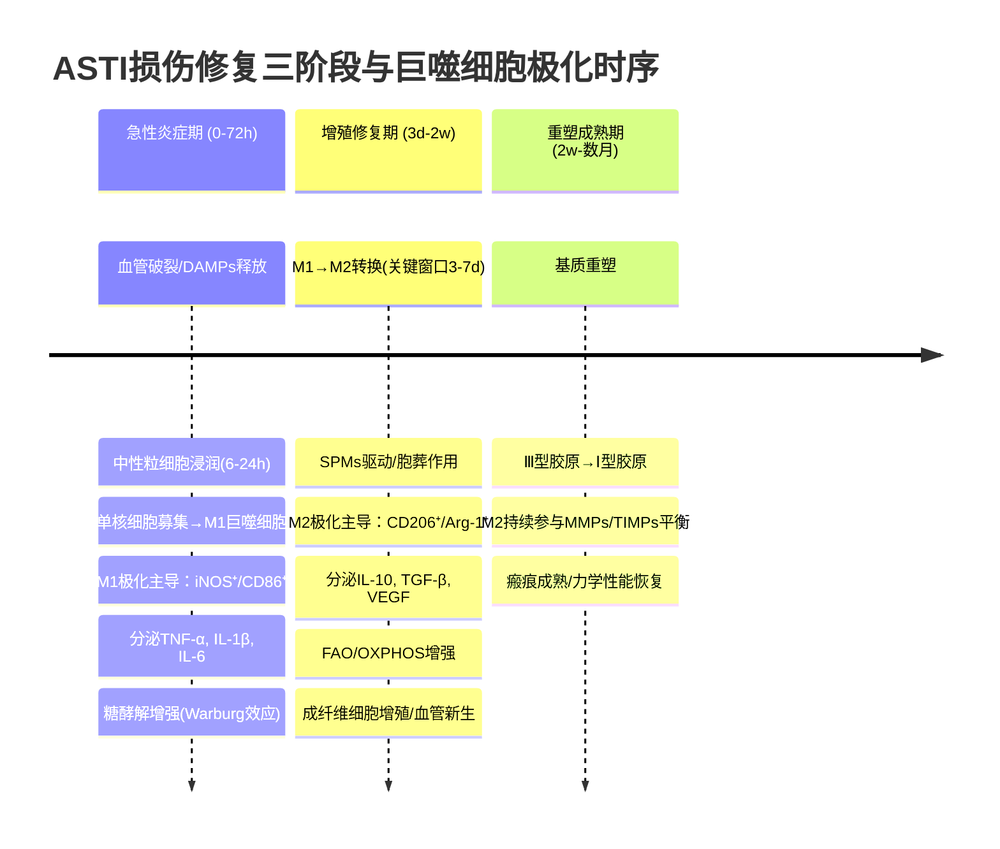
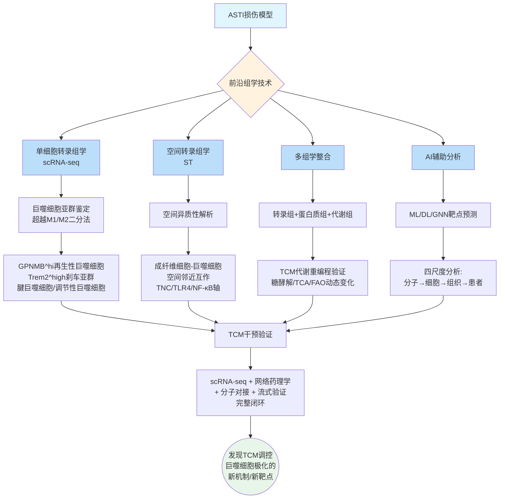

# 综述机制示意图（文本版 + 图片版）

---

## 图1：ASTI损伤修复三阶段与巨噬细胞动态转化时序图

### 设计说明
- **适用工具**：BioRender / draw.io / PowerPoint
- **尺寸建议**：横版 16:9，用于综述第2章
- **配色建议**：炎症期=红色系，修复期=蓝绿色系，重塑期=灰色系

### 图1 Mermaid代码（可直接渲染）



### 图1 文本示意（ASCII版）

```
时间轴 ─────────────────────────────────────────────────────►
       0h         72h        7d         2w          数月

  ┌─────────┐  ┌──────────┐  ┌─────────────────────────┐
  │急性炎症期│  │增殖修复期 │  │      重塑成熟期          │
  │ (0-72h) │  │ (3d-2w)  │  │      (2w-数月)          │
  └────┬────┘  └────┬─────┘  └───────────┬─────────────┘
       │            │                     │
  ┌────┴────┐  ┌────┴─────┐         ┌────┴────┐
  │ M1主导   │  │M1→M2转换 │         │ M2主导   │
  │ iNOS⁺    │  │ (3-7d)   │         │ CD206⁺  │
  │ CD86⁺    │  │ SPMs驱动  │         │ Arg-1⁺  │
  │ TNF-α↑   │  │ 胞葬作用  │         │ IL-10↑  │
  │ IL-1β↑   │  │          │         │ TGF-β↑  │
  │ IL-6↑    │  │          │         │         │
  └──────────┘  └──────────┘         └─────────┘

  ┌──────────┐  ┌──────────┐         ┌─────────┐
  │ 糖酵解↑  │  │代谢转换   │         │ FAO↑    │
  │ HIF-1α↑  │  │ 糖酵解→  │         │ OXPHOS↑ │
  │ PPP↑     │  │ OXPHOS   │         │ 完整TCA │
  └──────────┘  └──────────┘         └─────────┘

  【关键事件】
  • DAMPs释放 → TLR4/NLRP3激活
  • 中性粒细胞(6-24h) → 单核/巨噬细胞(24-72h)
  • M1/M2转换窗口(3-7d) = TCM最佳干预时机
  • 清除碎片 → 促修复 → 基质重塑
```

---

## 图2：巨噬细胞极化的信号通路-代谢重编程协同调控网络图

### 设计说明
- **适用工具**：BioRender（推荐）
- **尺寸建议**：正方形或竖版，用于综述第3章
- **核心理念**：上半部分为经典信号通路，下半部分为代谢重编程，中间通过关键节点（AMPK/mTOR, HIF-1α）连接

### 图2 文本示意

```
                    ┌──────────────────────────────────┐
                    │         细胞外信号                 │
                    │  LPS/IFN-γ(M1)   IL-4/IL-13(M2)  │
                    └───────┬──────────────┬────────────┘
                            │              │
     ┌──────────────────────┴──┐    ┌──────┴──────────────────┐
     │    【信号通路层】         │    │                          │
     │                          │    │                          │
     │  TLR4/MyD88 ──→ NF-κB   │    │  IL-4R ──→ STAT6        │
     │       │          ↑       │    │              │           │
     │  IFN-γR ──→ STAT1       │    │  PPARγ ←────────────┐   │
     │       │                  │    │              │       │   │
     │  Nrf2/HO-1 ←──→ NF-κB  │    │  Notch ──→ 命运决定  │   │
     │  (交叉抑制)              │    │                          │
     └──────────┬───────────────┘    └──────────┬───────────────┘
                │                               │
     ═══════════╪═══════ 【枢纽层】 ═════════════╪═══════════
                │                               │
     ┌──────────┴───────────────────────────────┴──────────┐
     │           AMPK ←────→ mTOR (全局调控节点)            │
     │              │            │                          │
     │         AMPK激活       mTORC1激活                    │
     │         → FAO↑         → 糖酵解↑                    │
     │         → M2极化       → M1极化                     │
     └──────────┬────────────────────────┬─────────────────┘
                │                        │
     ┌──────────┴──────────┐  ┌─────────┴──────────────────┐
     │  【代谢层 - M2】     │  │  【代谢层 - M1】            │
     │                      │  │                            │
     │  ● 完整TCA循环       │  │  ● 断裂TCA循环             │
     │  ● OXPHOS ↑         │  │  ● 糖酵解 ↑ (Warburg)     │
     │  ● FAO ↑            │  │  ● HIF-1α ↑               │
     │  ● Arg-1(精氨酸→    │  │  ● PPP ↑ (NADPH→ROS)     │
     │    鸟氨酸→胶原)     │  │  ● FAS ↑ (脂肪酸合成)     │
     │  ● 谷氨酰胺回补     │  │  ● 琥珀酸积累→稳定HIF-1α  │
     │    → α-KG ↑         │  │  ● iNOS(精氨酸→NO)        │
     └──────────┬──────────┘  └─────────┬──────────────────┘
                │                        │
     ┌──────────┴────────────────────────┴─────────────────┐
     │              【表观遗传层】                            │
     │                                                       │
     │  乙酰辅酶A ──→ H3K27ac ──→ M2基因转录激活            │
     │  α-KG ──→ TET/Jmjd3 ──→ DNA/组蛋白去甲基化          │
     │  琥珀酸/延胡索酸 ──→ 抑制去甲基化酶 ──→ M1维持       │
     └──────────────────────────────────────────────────────┘

     ═══ M1极化(促炎) ◄══════════════► M2极化(抗炎/修复) ═══
```

---

## 图3：TCM活性成分多靶点多通路调控巨噬细胞极化示意图

### 设计说明
- **适用工具**：BioRender（推荐）
- **布局**：中心为巨噬细胞，周围环绕5类TCM成分，箭头指向各自靶点/通路
- **配色**：每类成分使用不同颜色

### 图3 文本示意

```
                           ┌─────────────────────────┐
                           │    【皂苷类】 🟡          │
                           │  AS-IV → TLR4/NF-κB↓    │
                           │  NR1 → JAK1/STAT3↓      │
                           │  Rb1 → STAT6↑            │
                           │  Dioscin → mTORC2/PPARγ  │
                           └───────────┬──────────────┘
                                       │
     ┌─────────────────┐               │              ┌─────────────────┐
     │  【黄酮类】 🟢   │               ▼              │  【酚酸类】 🟠   │
     │ 槲皮素→TLR4↓   │      ┌──────────────┐        │ 丹参酮IIA→     │
     │ 葛根素→STAT1   │      │              │        │   ERβ/IL-10    │
     │   (直接结合)    │      │  巨噬细胞     │        │   STAT6↑       │
     │ 黄芩苷→AMPK↑   │      │              │        │   NF-κB↓       │
     │   (CaMKKβ)     │      │  M1 ◄──► M2 │        │ 隐丹参酮→      │
     └────────┬────────┘      │              │        │   糖酵解↑→M1   │
              │               └──────┬───────┘        └────────┬────────┘
              │                      │                         │
              │        ┌─────────────┴─────────────┐           │
              │        │                           │           │
     ┌────────┴────────┴───┐           ┌───────────┴───────────┴───┐
     │  【生物碱类】 🔵     │           │  【萜类及其他】 🟣          │
     │ BBR → AMPK↑          │           │ HSYA → XO抑制→NLRP3↓    │
     │   → mTORC1/HIF-1α↓  │           │   → ZBP1竞争性结合        │
     │   → 糖酵解切换       │           │   → AMPK/mTOR→自噬      │
     │ SIN → p62/Keap1→    │           │ 白藜芦醇 →              │
     │   Nrf2/HO-1↑        │           │   NF-κB↓/AMPK↑/PI3K-Akt │
     │   NF-κB↓            │           │   (浓度依赖性)           │
     └─────────────────────┘           └──────────────────────────┘

     ════════════════════ 【复方/外用制剂】 ═══════════════════
     │ 血府逐瘀汤 → 多靶点抗炎(COX-2/P38MAPK/TNF-α)           │
     │ 补阳还五汤 → M2极化/NF-κB↓                              │
     │ 栀黄膏(外用) → Treg趋化/局部免疫调控                    │
     │ 冲和膏(外用) → PI3K/Akt→NLRP3失活                     │
     │ 黄连解毒汤 → AMPK→M2↑/M1↓                              │
     ═══════════════════════════════════════════════════════════

     【汇总通路】
     膜受体 → 胞内信号 → 转录因子 → 代谢调控 → 表观遗传
     TLR4     NF-κB     PPARγ     AMPK/mTOR   H3K27ac
     CD206    MAPK      Nrf2      糖酵解       DNA甲基化
              STAT1/6   HIF-1α    FAO
              PI3K/Akt            氨基酸代谢
```

---

## 图4：前沿组学技术解析TCM调控巨噬细胞极化的研究策略流程图

### 设计说明
- **适用工具**：BioRender / draw.io
- **布局**：自上而下的流程图，展示从技术到发现的完整路径
- **核心理念**：技术如何赋能机制解析

### 图4 Mermaid代码



### 图4 文本示意

```
                    ┌─────────────────┐
                    │  ASTI损伤模型    │
                    └────────┬────────┘
                             │
                    ┌────────┴────────┐
                    │  前沿组学技术    │
                    └────────┬────────┘
                             │
          ┌──────────┬───────┼────────┬──────────┐
          │          │       │        │          │
    ┌─────┴─────┐ ┌──┴──┐ ┌──┴──┐ ┌──┴──┐ ┌────┴────┐
    │scRNA-seq  │ │ ST  │ │多组学│ │ AI  │ │代谢组学 │
    │单细胞转录组│ │空间  │ │整合  │ │辅助 │ │         │
    └─────┬─────┘ └──┬──┘ └──┬──┘ └──┬──┘ └────┬────┘
          │          │       │       │          │
    ┌─────┴─────┐ ┌──┴──┐ ┌──┴──┐ ┌──┴──┐ ┌────┴────┐
    │亚群鉴定   │ │空间  │ │转录+│ │ML/  │ │TCM代谢 │
    │GPNMB^hi   │ │异质性│ │蛋白+│ │DL/  │ │重编程  │
    │Trem2^high │ │TNC/  │ │代谢 │ │GNN  │ │验证    │
    │腱巨噬细胞 │ │TLR4  │ │     │ │靶点 │ │        │
    └─────┬─────┘ └──┬──┘ └──┬──┘ └──┬──┘ └────┬────┘
          │          │       │       │          │
          └──────────┴───────┼───────┴──────────┘
                             │
                    ┌────────┴────────┐
                    │  TCM干预验证    │
                    │  scRNA-seq + NP │
                    │  + 分子对接     │
                    │  + 流式验证     │
                    └────────┬────────┘
                             │
                    ┌────────┴────────┐
                    │  发现新机制      │
                    │  新靶点          │
                    └─────────────────┘
```

---

## 图片生成说明

以上4张图的Mermaid代码可以在以下平台直接渲染为图片：
- **Mermaid Live Editor**: https://mermaid.live
- **VS Code**: 安装 Mermaid Preview 插件
- **GitHub**: 直接嵌入Markdown即可渲染

BioRender制作建议：
- 图1: 时间轴布局，三阶段用渐变色区分
- 图2: 细胞示意图，上信号通路+下代谢层
- 图3: 中心辐射布局，巨噬细胞居中
- 图4: 自上而下流程图
